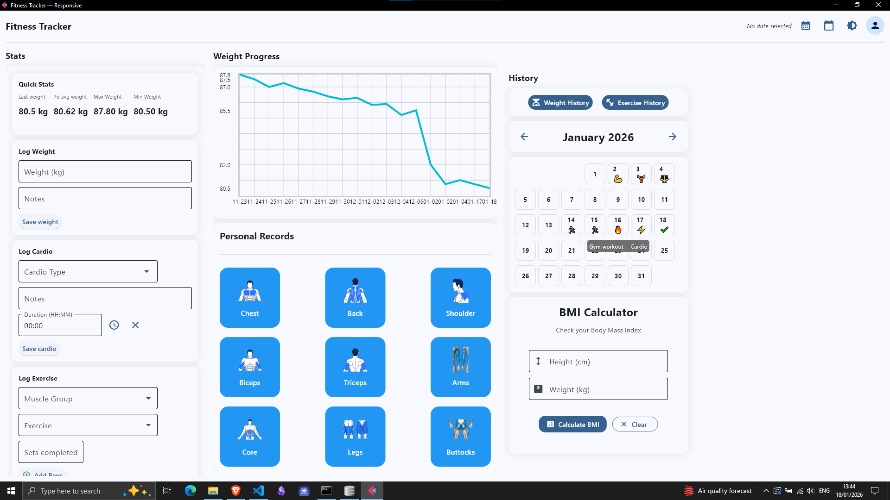
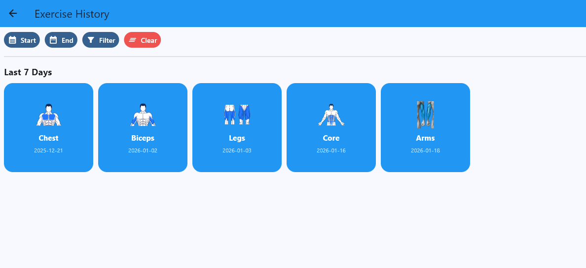

### 📥 Clone the Repository

`git clone https://github.com/your-username/fitness-tracker-app.git
cd fitness-tracker-app`

> After cloning just navigate to the **stable_version** branch.

* * * * *

### 🧪 Create a Virtual Environment (Recommended)

`python -m venv venv`

Activate it:

-   **Windows**

`venv\Scripts\activate`

-   **macOS / Linux**

`source venv/bin/activate`

* * * * *

### 📦 Install Dependencies

`pip install -r requirements.txt`

If `requirements.txt` is missing, install Flet manually:

`pip install flet` version 0.28.3

* * * * *

### 🗄️ Database Setup (Automatic)

You **do not need to manually create the database**.

After creating the tables copy the text from **muscle_groups.sql and execute it.** 

On app startup:

-   Tables are created if missing

-   Seed data (exercise list) is inserted safely, need to be manually inserted for muscle_groups

-   Existing data is preserved

This is handled automatically in:

`init_db()`

* * * * *

### ▶️ Run the Application

`python main.py`

second page for prs

new page for history
weights

exercise 

dark mode

